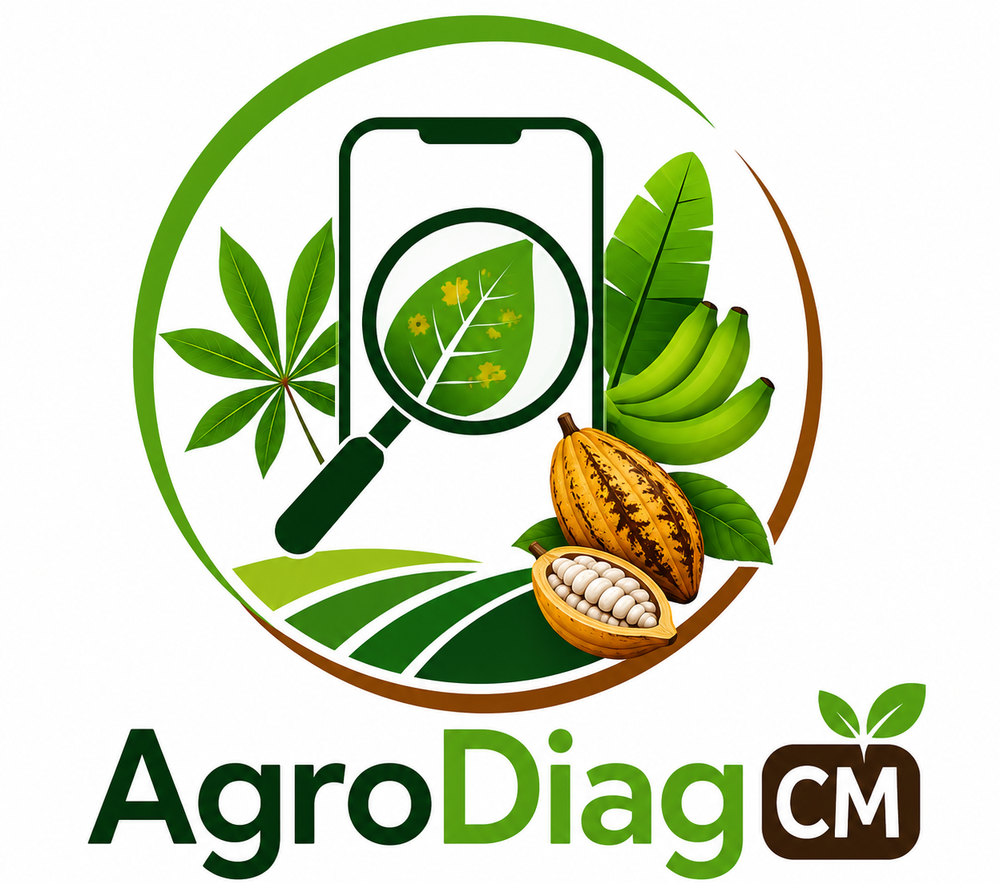

# AgroDiag — Offline Crop Disease Diagnosis for Smallholder Farmers

<p align="center">
  
</p>

<p align="center">
  <strong>A phone app that diagnoses crop diseases from a photo — completely offline — and a web dashboard that turns those scans into outbreak intelligence for agronomists, NGOs and government.</strong>
</p>

<p align="center">
  <a href="https://github.com/Alchimiste237/AgriDiag/actions/workflows/deploy-dashboard.yml"></a>
</p>

<p align="center">
  <a href="docs/README_nontechnical.md">Non-technical guide</a> ·
  <a href="app/adminDashboard/SETUP.md">Dashboard setup</a> ·
  <a href="app/crop_disease_app/README_crop_detector.md">Model training</a>
</p>

---

## What's in this repository

| Path | What it is |
|------|-----------|
| [`app/crop_disease_app/`](app/crop_disease_app) | **Flutter mobile app** (Android, iOS, desktop, web). On-device TFLite inference — works with no internet. |
| [`app/adminDashboard/`](app/adminDashboard) | **React + Vite monitoring dashboard**. Live Supabase data: maps, analytics, scan log, alerts, retraining readiness. |
| [`app/adminDashboard/supabase/schema.sql`](app/adminDashboard/supabase/schema.sql) | Shared database schema + row-level security policies. |
| [`app/crop_disease_app/supabase/migrations/`](app/crop_disease_app/supabase/migrations) | Incremental SQL migrations applied on top of the base schema. |
| [`app/crop_disease_app/crop_detector.py`](app/crop_disease_app/crop_detector.py) | Training script for the crop auto-recognition classifier. |

> **Live dashboard:** published automatically by GitHub Actions → GitHub Pages on every push to `main`. See [Deployment](#deployment).

## How it works

```
 ┌──────────────────────┐        ┌─────────────────────┐        ┌──────────────────────┐
 │  Farmer's phone      │        │   Supabase (cloud)  │        │  Admin dashboard     │
 │  ─────────────       │        │   ───────────────   │        │  ───────────────     │
 │  photo → TFLite      │  sync  │   farmers table     │  read  │  Leaflet map         │
 │  crop classifier     │ ─────► │   scans table       │ ─────► │  analytics / charts  │
 │  disease model       │ (when  │   RLS policies      │        │  alert engine        │
 │  Hive local history  │ online)│   scan-images bucket│        │  retraining queue    │
 └──────────────────────┘        └─────────────────────┘        └──────────────────────┘
```

1. **Capture** — the farmer photographs a leaf. The app recognises which of the 4 supported crops it is (or rejects the photo as "not a crop") and runs the matching disease model, all on-device.
2. **Advise** — the result, severity and treatment recommendations are shown in English or French, with text-to-speech so low-literacy users can listen to the advice. Everything is stored locally in Hive, so it works with no signal.
3. **Sync** — when connectivity returns, scans are pushed to Supabase (insert-only, enforced by row-level security).
4. **Monitor** — the dashboard reads the same tables: outbreak heatmap, disease trends, a verifiable scan log (analysts record ground truth), anomaly alerts with an SMS broadcast composer, and a dataset-readiness view for model retraining.

## Mobile app (`app/crop_disease_app`)

**Supported crops:** Banana · Cacao · Cassava · Maize — each with its own disease model, plus a `crop_classifier` that rejects out-of-scope photos instead of force-labelling them.

| Feature | Implementation |
|---------|----------------|
| On-device inference | `tflite_flutter` + quantised `.tflite` models bundled as assets |
| Crop auto-recognition | `crop_classifier.tflite` with a 5th "background" class |
| Offline-first history | Hive boxes (`lib/core/services/storage_service.dart`) |
| Background sync | `connectivity_plus` + Supabase REST (`lib/core/services/sync_service.dart`) |
| Voice advice | `flutter_tts`, English/French (`lib/core/services/voice_service.dart`) |
| Location tagging | `geolocator` → state/LGA on every scan |
| Localisation | Hand-rolled EN/FR strings, no codegen (`lib/l10n/app_strings.dart`) |
| UI | Material 3, custom AgroDiag theme (`lib/core/config/app_theme.dart`) |

### Run the app

```bash
cd app/crop_disease_app
flutter pub get
flutter run            # connected device or emulator
```

Point it at your Supabase project by editing `lib/core/config/supabase_config.dart` (project URL + anon key). Until then `isConfigured` is false and scan syncing is a harmless no-op.

## Dashboard (`app/adminDashboard`)

React 18 · Vite 5 · React Router 6 · Recharts · Leaflet · Supabase JS.

| Route | Page |
|-------|------|
| `/` | **Overview** — KPI cards, Leaflet heatmap of detections, top diseases |
| `/analytics` | **Analytics & Insights** — disease-by-crop breakdown, outbreak timeline |
| `/scans` | **Farmer Scans Log** — searchable table, record ground truth per scan |
| `/alerts` | **Alerts & Outbreak Advisory** — anomaly flags + SMS broadcast composer |
| `/retraining` | **Model Retraining** — verified-scan breakdown, dataset readiness |

### Run the dashboard

```bash
cd app/adminDashboard
npm ci
cp .env.example .env      # fill in your Supabase URL + anon key
npm run dev               # http://localhost:5173
```

Full walkthrough (Supabase project, schema, storage bucket): **[adminDashboard/SETUP.md](app/adminDashboard/SETUP.md)**.

### Database

`app/adminDashboard/supabase/schema.sql` is idempotent (`create table if not exists`) and creates:

- **`farmers`** — `code`, `name`, `village`, `phone`, `lga`
- **`scans`** — model output, confidence, image URL, GPS (`latitude`/`longitude`, `state`, `lga`), device timestamp, and verification columns (`ground_truth_label`, `verified`, `verified_at`, `verified_by`)

RLS is deliberately simple for a pilot: the mobile app may **insert** only; admins get full access. Run the base schema once in the Supabase SQL Editor, then apply anything in `app/crop_disease_app/supabase/migrations/`.

## Model training

`crop_detector.py` trains the crop classifier over a dataset laid out as `raw/<Crop>/<anything>/*.jpg`, including a `background/` class so photos of walls and hands are rejected. See **[README_crop_detector.md](app/crop_disease_app/README_crop_detector.md)** for dataset structure, label derivation and the background-class guidance.

Converted `.tflite` files ship as app assets. The original `.keras` training checkpoints are intentionally **not** committed (67 MB of weights the app never loads) — retrain from the script if you need them.

## Deployment

The dashboard is deployed to **GitHub Pages** by [`.github/workflows/deploy-dashboard.yml`](.github/workflows/deploy-dashboard.yml):

1. Push to `main` (with changes under `app/adminDashboard/`).
2. The workflow installs dependencies, builds with `VITE_BASE: /<repo-name>/` so Vite emits correct asset URLs, and adds a `404.html` copy of `index.html` so deep links like `/repo/analytics` survive a hard refresh on Pages.
3. `actions/deploy-pages` publishes the artifact.

### Required repository secrets

Go to **Settings → Secrets and variables → Actions** and add:

| Secret | Value |
|--------|-------|
| `VITE_SUPABASE_URL` | Your Supabase project URL |
| `VITE_SUPABASE_ANON_KEY` | Your Supabase anon (public) key |
| `VITE_CARTO_API_KEY` | *(optional)* CARTO basemap key; falls back to OpenStreetMap |

### First-time Pages setup

**Settings → Pages → Source: GitHub Actions.**

## Tech stack

| Layer | Choice |
|-------|--------|
| Mobile | Flutter 3 · Material 3 |
| On-device ML | TensorFlow Lite (`tflite_flutter`), Keras for training |
| Backend | Supabase (Postgres + Auth + Storage), row-level security |
| Dashboard | React 18 · Vite 5 · React Router 6 |
| Visualisation | Recharts · Leaflet + CARTO/OSM tiles |
| Local storage | Hive (Flutter) |
| CI/CD | GitHub Actions → GitHub Pages |
| Languages | Dart · TypeScript-free JS/JSX · Python (training) · SQL |

## Repository hygiene

Ignored on purpose: `node_modules/`, `dist/`, `build/`, `.dart_tool/`, `__pycache__/`, `*.keras`, `.env` (only `.env.example` is tracked), IDE folders, and the unrelated `rapport/` / `training/` / Office documents that live next to this project.

## Roadmap

- Expand beyond the current 4 crops and wire in tomato/potato late-blight models
- SMS delivery integration behind the dashboard's broadcast composer
- Multi-admin roles and audit trail for ground-truth verification
- Model drift monitoring fed by the retraining queue

## License

Add a license before publishing publicly — none is committed yet.

---

*AgroDiag — diagnose your crops today, for a healthier tomorrow.*
